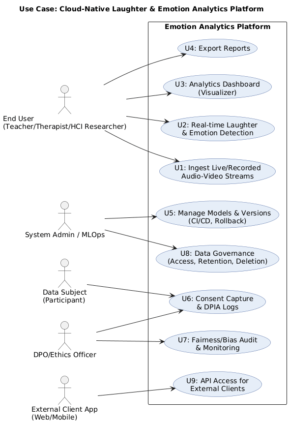
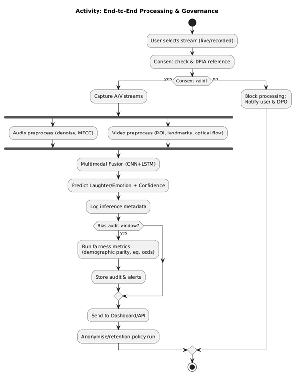
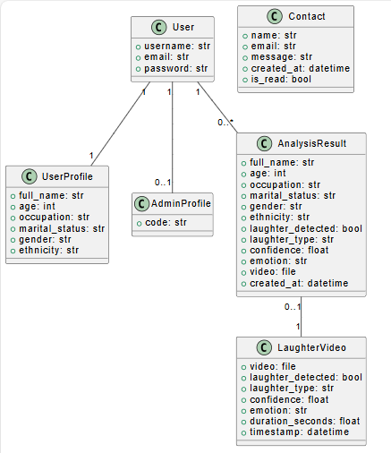
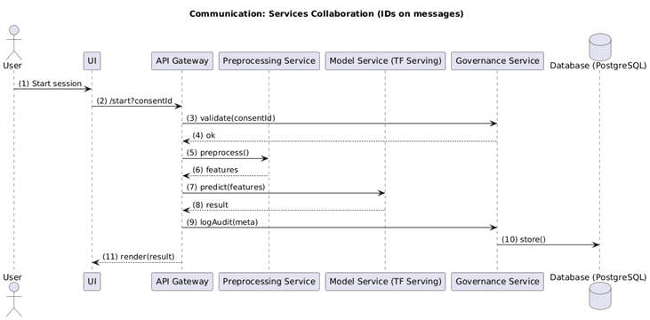
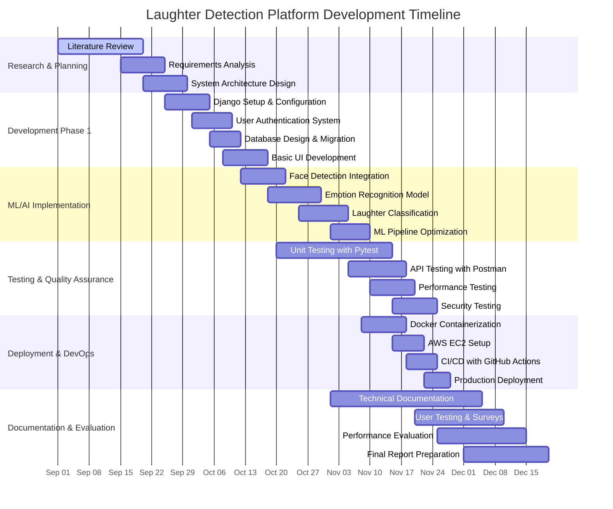
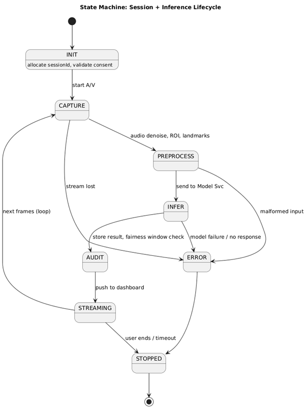

> **Author:** Ugwute Charles Ogbonna  
> **Programme:** MSc Software Engineering, University of Bolton  
> **Supervisor:** Aamir Abbas

# Methodology

## Research Philosophy & Design

### Philosophical Approach
- **Pragmatic Research Paradigm:** Combines quantitative performance metrics with qualitative user experience evaluation
- **Mixed-Methods Design:** Utilizes **Concurrent Triangulation** for comprehensive validation
- **Thematic Literature Methodology:** Systematic literature review for technical foundation

### Design Philosophy

*Figure 1: Mixed-Methods Concurrent Triangulation Design Approach*

## System Design

### Use Case Diagram

*Figure 2: System Use Case Diagram showing user interactions and core functionalities*

### Activity Diagram: Video Processing Workflow

*Figure 3: Activity Diagram showing the complete video processing workflow from upload to completion*

### Class Diagram: Core System Components

*Figure 4: Class Diagram showing the core system components, relationships, and methods*

### Sequence Diagram: User Authentication & Video Processing

*Figure 5: Sequence Diagram illustrating user authentication flow and video processing interaction between system components*

## Project Timeline: Gantt Chart (September - December 2024)

## Development Methodology

### Agile Framework
- **Kanban Methodology:** Continuous flow approach with visual task management
- **Sprint Duration:** 2-week iterations for rapid development cycles
- **Daily Standups:** Progress tracking and impediment identification
- **Retrospectives:** Continuous improvement and process optimization

### Project Management Tools
- **Trello Boards:** Visual task management with swim lanes:
  - Backlog → In Progress → Testing → Done
  - Priority labeling system (High/Medium/Low)
  - Due date tracking and milestone management
- **GitHub Projects:** Integration with code repository for seamless workflow
- **Slack/Discord:** Team communication and automated notifications

### Software Development Life Cycle (SDLC)

*Figure 6: Software Development Life Cycle with Continuous Integration approach*

## Research Methods

### Quantitative Research
- **Performance Metrics Collection:**
  - Accuracy, Precision, Recall, F1-Score
  - Latency measurements (p95 < 100ms target)
  - Throughput analysis (concurrent users)
  - Resource utilization monitoring

- **Statistical Analysis:**
  - Comparative analysis with baseline models
  - Confidence interval calculations
  - Hypothesis testing for performance improvements

### Qualitative Research
- **User Experience Evaluation:**
  - **Likert-Scale Surveys:** 5-point scale for usability assessment
  - **Semi-structured Interviews:** In-depth user feedback collection
  - **Thematic Analysis:** Coding and categorization of user responses

- **Questionnaire Design:**
  - System Usability Scale (SUS) implementation
  - Custom questions for domain-specific evaluation
  - Demographic data collection for stratified analysis

### Sampling Strategy
- **Purposive Sampling:** Target users with relevant domain expertise
- **Stratified Sampling:** Representation across user roles (students, teachers, parents)
- **Sample Size:** Minimum 30 participants per user category for statistical significance

### Mixed-Methods Integration
- **Concurrent Triangulation Design:**
  - Simultaneous quantitative and qualitative data collection
  - Independent analysis followed by integration
  - Convergent findings strengthen conclusions
  - Divergent findings prompt deeper investigation

## Technical Implementation Methods

### Development Tools & Environment
- **IDE:** VS Code (primary), PyCharm (secondary)
- **Version Control:** Git with GitHub repository management
- **Code Quality:** Black formatter, Flake8 linting, pre-commit hooks

### Backend Development
- **Framework:** Django 5.2.4 with Python 3.10+
- **Database:** PostgreSQL (production), SQLite (development/testing)
- **Security Implementation:**
  - JWT (JSON Web Tokens) for authentication
  - CORS configuration for cross-origin requests
  - CSRF protection and secure headers
  - Input validation and sanitization

### Machine Learning Pipeline
- **Frameworks:** TensorFlow 2.x, OpenCV 4.x
- **Model Training:** Jupyter Notebook for experimentation and analysis
- **Face Detection:** MTCNN (Multi-task CNN) implementation
- **Emotion Recognition:** FER (Facial Emotion Recognition) library integration

### Testing Strategy
- **Unit Testing:** Pytest framework with comprehensive test coverage
- **Integration Testing:** Django TestCase for database interactions
- **API Testing:** Postman collections with automated test scripts
- **Load Testing:** Artillery.js for performance validation

### Quality Assurance
- **API Documentation:** Swagger/OpenAPI specifications
- **Manual Testing:** CURL commands for endpoint validation
- **Code Review:** Pull request workflow with mandatory reviews
- **Continuous Monitoring:** Application performance monitoring (APM)

### DevOps & Deployment
- **Containerization:** Docker with multi-stage builds
- **Orchestration:** Kubernetes for scalable deployment
- **Cloud Platform:** AWS EC2 with auto-scaling groups
- **CI/CD Pipeline:** GitHub Actions for automated testing and deployment

### Documentation & Knowledge Sharing
- **Technical Documentation:** Hashnode blog for public sharing
- **Repository Documentation:** GitHub README and wiki pages
- **API Documentation:** Interactive Swagger UI
- **Deployment Guides:** Step-by-step setup instructions

### Analytics & Monitoring
- **Qualitative Analysis:** Monkey Survey for user feedback collection
- **Performance Monitoring:** Custom Django middleware for metrics
- **Error Tracking:** Integrated logging with structured output
- **Business Intelligence:** Custom dashboard for key performance indicators

## Ethical Considerations

### Data Privacy & Security
- **GDPR Compliance:** User consent mechanisms and data portability
- **Data Minimization:** Collection limited to essential functionality
- **Secure Storage:** Encryption at rest and in transit
- **Access Controls:** Role-based permissions and audit trails

### Bias Mitigation
- **Diverse Training Data:** Multi-demographic representation
- **Fairness Testing:** Cross-cultural validation of emotion detection
- **Algorithmic Transparency:** Explainable AI techniques
- **Continuous Monitoring:** Bias detection in production results

### User Consent & Transparency
- **Informed Consent:** Clear explanation of data usage
- **Opt-out Mechanisms:** User control over data processing
- **Regular Communication:** Updates on data handling practices
- **Third-party Audits:** Independent privacy assessments

## Validation & Reliability

### Internal Validity
- **Controlled Environment:** Standardized testing conditions
- **Confounding Variables:** Identification and mitigation strategies
- **Instrumentation:** Calibrated measurement tools and metrics

### External Validity
- **Generalizability:** Multi-domain testing scenarios
- **Population Validity:** Representative user sample selection
- **Ecological Validity:** Real-world usage patterns simulation

### Reliability Measures
- **Test-Retest Reliability:** Consistent results across time periods
- **Inter-rater Reliability:** Agreement between multiple evaluators
- **Internal Consistency:** Cronbach's alpha for survey instruments

### Reproducibility
- **Code Versioning:** Complete source code availability
- **Data Provenance:** Detailed dataset documentation
- **Environment Specification:** Docker containers for consistent deployment
- **Experiment Logging:** Comprehensive MLflow experiment tracking

---

© 2025 Ugwute Charles Ogbonna — MSc Software Engineering, University of Bolton.  
Licensed for academic and research use only.

