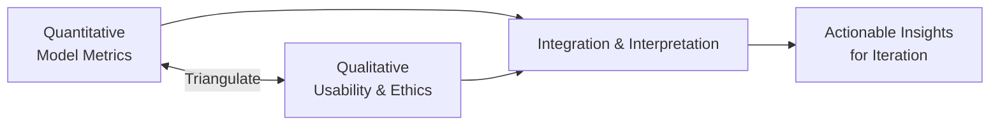

> **Author:** Ugwute Charles Ogbonna  
> **Programme:** MSc Software Engineering, University of Bolton  
> **Supervisor:** Aamir Abbas

# Methodology

## Philosophy & Design
- **Pragmatism:** combines quantitative performance with qualitative UX/ethics.
- **Design:** **Mixed-Methods** using **Concurrent Triangulation**.

## Mixed-Methods Diagram

## Quantitative
- Metrics: Accuracy, Precision, Recall, F1, Latency.
- Datasets: Audio-visual samples (laughter / non-laughter).
- Tooling: Python, TensorFlow/PyTorch, scikit-learn, OpenCV.

## Qualitative
- **Usability testing** with Likert-scale surveys.
- **Ethical review**: consent, privacy, bias/fairness.

## Validity & Reliability
- Triangulation across methods.
- Reproducible pipelines (CI), dataset documentation, versioned models.

---

© 2025 Ugwute Charles Ogbonna — MSc Software Engineering, University of Bolton.  
Licensed for academic and research use only.

