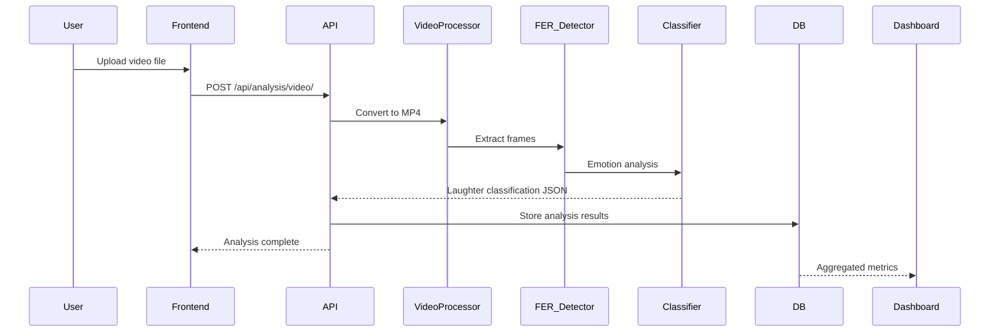

> **Author:** Ugwute Charles Ogbonna  
> **Programme:** MSc Software Engineering, University of Bolton  
> **Supervisor:** Aamir Abbas

# System Architecture

## Overview of the AI Pipeline

The system uses a multi-layered AI approach combining:

1. **Video Processing**: FFmpeg and MoviePy for format conversion
2. **Computer Vision**: OpenCV for frame extraction and processing
3. **Facial Emotion Recognition**: FER library with MTCNN face detection
4. **Deep Learning**: TensorFlow backend for neural networks
5. **Classification**: Custom algorithms for laughter type detection

## Microservices View
```mermaid
flowchart TD
  FE[Frontend (HTML/JS/Bootstrap)] --> GW[/Nginx Gateway/]
  GW --> API[Django REST API]
  API --> PRE[Preprocessing Service]
  PRE --> DET[Laughter Detector (DL)]
  DET --> EMO[Emotion Classifier]
  API --> MQ[(Message Queue)]
  EMO --> MQ
  MQ --> DB[(PostgreSQL)]
  MQ --> DASH[Analytics Dashboard]
  
  subgraph ML_Pipeline [ML Processing Pipeline]
    VID[Video Input] --> FF[FFmpeg Converter]
    FF --> CV[OpenCV Frame Extractor]
    CV --> FER[FER Emotion Detector]
    FER --> CLS[Laughter Classifier]
    CLS --> RES[Analysis Results]
  end
  
  PRE --> ML_Pipeline
  ML_Pipeline --> EMO
```
**Rationale:** separation of concerns, independent scaling, fault isolation.

## Core ML Components

### 1. Facial Emotion Recognition (FER) Setup

The FER library provides state-of-the-art emotion recognition capabilities:

```python
from fer import FER
import cv2
import numpy as np

# Initialize FER with MTCNN for better face detection
def initialize_emotion_detector():
    return FER(
        mtcnn=True,  # Use MTCNN for better face detection
        compile=True,  # Compile for better performance
        cache=True  # Cache models for faster loading
    )
```

### 2. Video Processing Pipeline

Our video processing pipeline handles multiple formats and optimizes for ML analysis:

```python
import os
import subprocess
from moviepy.editor import VideoFileClip

def convert_to_mp4(input_path):
    """
    Convert video to MP4 format using FFmpeg
    Optimized for ML processing
    """
    base, ext = os.path.splitext(input_path)
    output_path = f"{base}_converted.mp4"
    
    if ext.lower() == '.mp4':
        return input_path
    
    # FFmpeg command with optimization flags
    command = [
        'ffmpeg', '-y',  # Overwrite output
        '-i', input_path,
        '-c:v', 'libx264',  # H.264 codec
        '-preset', 'fast',   # Encoding speed
        '-crf', '23',        # Quality setting
        '-c:a', 'aac',       # Audio codec
        '-strict', 'experimental',
        output_path
    ]
    
    try:
        subprocess.run(command, check=True, capture_output=True)
        return output_path
    except subprocess.CalledProcessError as e:
        raise Exception(f"Video conversion failed: {e}")
```

### 3. Advanced Emotion Analysis

Our emotion analysis goes beyond basic detection to classify specific laughter types:

```python
def analyze_video_emotions(video_path):
    """
    Comprehensive video emotion analysis with frame sampling
    """
    detector = initialize_emotion_detector()
    
    # Open video file
    cap = cv2.VideoCapture(video_path)
    frame_rate = cap.get(cv2.CAP_PROP_FPS)
    total_frames = int(cap.get(cv2.CAP_PROP_FRAME_COUNT))
    
    emotions_timeline = []
    frame_count = 0
    
    # Sample frames intelligently (every 10th frame)
    while True:
        ret, frame = cap.read()
        if not ret:
            break
            
        if frame_count % 10 == 0:
            # Detect emotions in current frame
            results = detector.detect_emotions(frame)
            
            if results:
                # Get the dominant face's emotions
                dominant_face = max(results, key=lambda x: x['box'][2] * x['box'][3])
                
                emotions_timeline.append({
                    'timestamp': frame_count / frame_rate,
                    'emotions': dominant_face['emotions'],
                    'face_box': dominant_face['box']
                })
        
        frame_count += 1
    
    cap.release()
    
    return analyze_emotion_timeline(emotions_timeline)
```

### 4. Laughter Classification Algorithm

Our sophisticated classification system identifies different types of laughter:

```python
def classify_laughter_patterns(avg_emotions, timeline):
    """
    Advanced laughter classification based on emotion patterns
    """
    happy_level = avg_emotions.get('happy', 0.0)
    surprise_level = avg_emotions.get('surprise', 0.0)
    neutral_level = avg_emotions.get('neutral', 0.0)
    
    # Calculate confidence based on consistency
    confidence = calculate_confidence(timeline)
    
    # Laughter detection threshold
    laughter_detected = happy_level > 0.3 or (happy_level > 0.2 and surprise_level > 0.2)
    
    # Classify laughter type using advanced rules
    laughter_type = "None"
    
    if laughter_detected:
        if happy_level > 0.7:
            laughter_type = "Joyful Laugh"
        elif happy_level > 0.5 and surprise_level > 0.3:
            laughter_type = "Surprised Laugh"
        elif happy_level > 0.4 and avg_emotions.get('fear', 0) > 0.2:
            laughter_type = "Nervous Laugh"
        elif happy_level > 0.4 and neutral_level > 0.3:
            laughter_type = "Polite Laugh"
        elif 0.3 < happy_level <= 0.5:
            laughter_type = "Soft Chuckle"
        else:
            laughter_type = "Mild Amusement"
    
    # Get dominant emotion
    dominant_emotion = max(avg_emotions, key=avg_emotions.get)
    
    return {
        "laughter_detected": laughter_detected,
        "laughter_type": laughter_type,
        "confidence": round(confidence, 2),
        "emotion": dominant_emotion.capitalize(),
        "emotion_breakdown": avg_emotions,
        "duration_analysis": analyze_duration_patterns(timeline)
    }
```

## Data Flow


## Database Schema

### Core Models

1. **User Model** (Custom)
   - username: CharField(max_length=20, unique=True)
   - email: EmailField(max_length=50, unique=True)

2. **UserProfile Model**
   - user: OneToOneField(User)
   - full_name: CharField(max_length=100)
   - age: PositiveIntegerField()
   - occupation: CharField(max_length=100)
   - marital_status: CharField(max_length=50)
   - gender: CharField(max_length=20)
   - ethnicity: CharField(max_length=50)

3. **AnalysisResult Model**
   - user: ForeignKey(User)
   - laughter_detected: BooleanField()
   - laughter_type: CharField(max_length=50)
   - confidence: FloatField()
   - emotion: CharField(max_length=50)
   - video: FileField()
   - created_at: DateTimeField()

4. **LaughterVideo Model**
   - video: FileField()
   - laughter_detected: BooleanField()
   - laughter_type: CharField()
   - confidence: FloatField()
   - emotion: CharField()
   - timestamp: DateTimeField()

## Performance Optimization

### Real-time Processing Optimization

For production environments, we implement several optimization strategies:

```python
import asyncio
from concurrent.futures import ThreadPoolExecutor
import multiprocessing

class OptimizedVideoAnalyzer:
    def __init__(self):
        self.executor = ThreadPoolExecutor(max_workers=multiprocessing.cpu_count())
        self.detector_cache = {}
    
    def get_detector(self, worker_id):
        """Thread-safe detector management"""
        if worker_id not in self.detector_cache:
            self.detector_cache[worker_id] = FER(mtcnn=True)
        return self.detector_cache[worker_id]
    
    async def analyze_video_async(self, video_path):
        """Asynchronous video analysis for better performance"""
        loop = asyncio.get_event_loop()
        result = await loop.run_in_executor(
            self.executor,
            self._analyze_video_sync,
            video_path
        )
        return result
```

## Security & Privacy (high level)
- JWT auth, HTTPS, role-based access (admin/teacher/parent/student as needed)
- Data minimisation, retention policy, opt-in consent, PII avoidance
- Rate limiting and request validation
- Video file validation and sanitization
- Secure temporary file handling

## Scalability Considerations

### Horizontal Scaling
- Microservices architecture enables independent scaling
- Load balancer distribution for API endpoints
- Database read replicas for analytics queries
- Async task queues for video processing

### Performance Metrics
- Frame processing rate: Target 30 FPS
- Analysis latency: < 2 seconds for 10-second video
- Concurrent users: Support 100+ simultaneous uploads
- Storage efficiency: Automatic cleanup of temporary files


---

© 2025 Ugwute Charles Ogbonna — MSc Software Engineering, University of Bolton.  
Licensed for academic and research use only.

